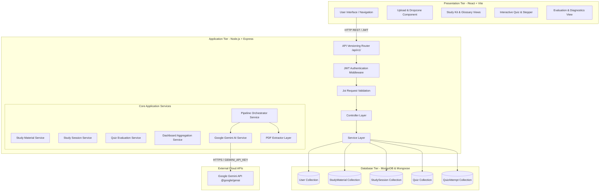

# Preply - Technical Architecture Specification

## 1. System Overview

Preply is an AI-powered student workspace engineered for a single, continuous, grounded end-to-end exam preparation workflow:

```text
Upload PDF ──► Validate & Extract ──► AI Analysis ──► Study Kit & Quiz ──► Take Quiz ──► Evaluate & Weak Topics
```

The system strictly decouples the client user interface, business application layer, database persistence engine, and external AI services.

---

## 2. High-Level Architecture Diagram



---

## 3. Layered Request Flow Architecture

Preply enforces a strict layered request flow across the Express backend to ensure separation of concerns and eliminate business logic in routes:

```text
HTTP Request ──► Route ──► Auth Middleware ──► Validation ──► Controller ──► Service ──► Model/Repository ──► Database ──► Formatted Response
```

1. **Routes (`backend/src/routes/`)**: Defines path endpoints and maps HTTP methods (`GET`, `POST`, `DELETE`) to controller actions under `/api/v1/`.
2. **Authentication Middleware (`backend/src/middleware/auth.js`)**: Verifies JWT tokens in `Authorization: Bearer <token>` headers and populates `req.user`.
3. **Validation Middleware (`backend/src/middleware/validate.js`)**: Validates request parameters and payload bodies using Joi schemas (`backend/src/validators/`). Rejects malformed input with a `400 Bad Request`.
4. **Controllers (`backend/src/controllers/`)**: Handles request parameters, extracts inputs, calls service layer methods, and formats standard HTTP responses.
5. **Services (`backend/src/services/`)**: Implements core business logic, document text processing, Gemini AI prompt construction, quiz grading algorithms, and weak-topic detection.
6. **Models (`backend/src/models/`)**: Mongoose models (`User`, `StudyMaterial`, `StudySession`, `Quiz`, `QuizAttempt`) managing MongoDB data persistence and indexing.

---

## 4. Modular Document Processing Architecture

Document extraction is decoupled behind an extensible object hierarchy:

```text
                ┌──────────────────┐
                │ BaseExtractor    │
                └────────┬─────────┘
                         │
        ┌────────────────┴────────────────┐
        ▼                                 ▼
┌─────────────────┐             ┌─────────────────┐
│ PdfExtractor    │             │ Docx/Pptx       │
│ (pdf-parse)     │             │ (Future Ext.)   │
└─────────────────┘             └─────────────────┘
```

- **`BaseExtractor.js`**: Defines the base extractor contract requiring `extractText(fileBuffer)`.
- **`PdfExtractor.js`**: Implements PDF binary extraction via `pdf-parse`, validating magic bytes (`%PDF-`), normalizing whitespace, and extracting text metadata (character/word counts).
- **`ExtractorFactory.js`**: Returns the matching extractor instance based on file extension and MIME type.

---

## 5. Server-Side AI Integration Architecture

```text
[Extracted PDF Text] ──► [promptBuilder.js] ──► [geminiService.js (@google/genai)] ──► [aiResponseValidator.js] ──► [Database Persistence]
```

- **Backend Isolation**: Gemini API requests are executed strictly on the server (`backend/src/services/geminiService.js`). No API keys or SDK calls are exposed to client browsers.
- **Strict Fact-Grounding Directive**: Prompts prepend a mandatory system instruction requiring Gemini to base answers strictly on the supplied document text to eliminate hallucinations.
- **Deterministic JSON Schemas**: Gemini returns structured JSON matching explicit application schemas for study kits, quizzes, and weak topic evaluations.
- **Sanitizer & Validator (`aiResponseValidator.js`)**: Strips markdown code blocks, normalizes string indices to numbers, and validates response structure before saving to MongoDB.
- **Offline Mock Fallback**: In the absence of a live `GEMINI_API_KEY`, the service automatically falls back to deterministic mock responses for offline or local testing.

---

## 6. Multi-Tenant Authorization Security Boundary

Every resource query in the repository layer strictly enforces `{ _id: id, userId: req.user.id }`:

- Preventing User B from viewing, modifying, or deleting User A's study materials, study kits, practice quizzes, or attempt histories.
- Returning a clean `404 Not Found` response if a user attempts to access a resource owned by another tenant.
