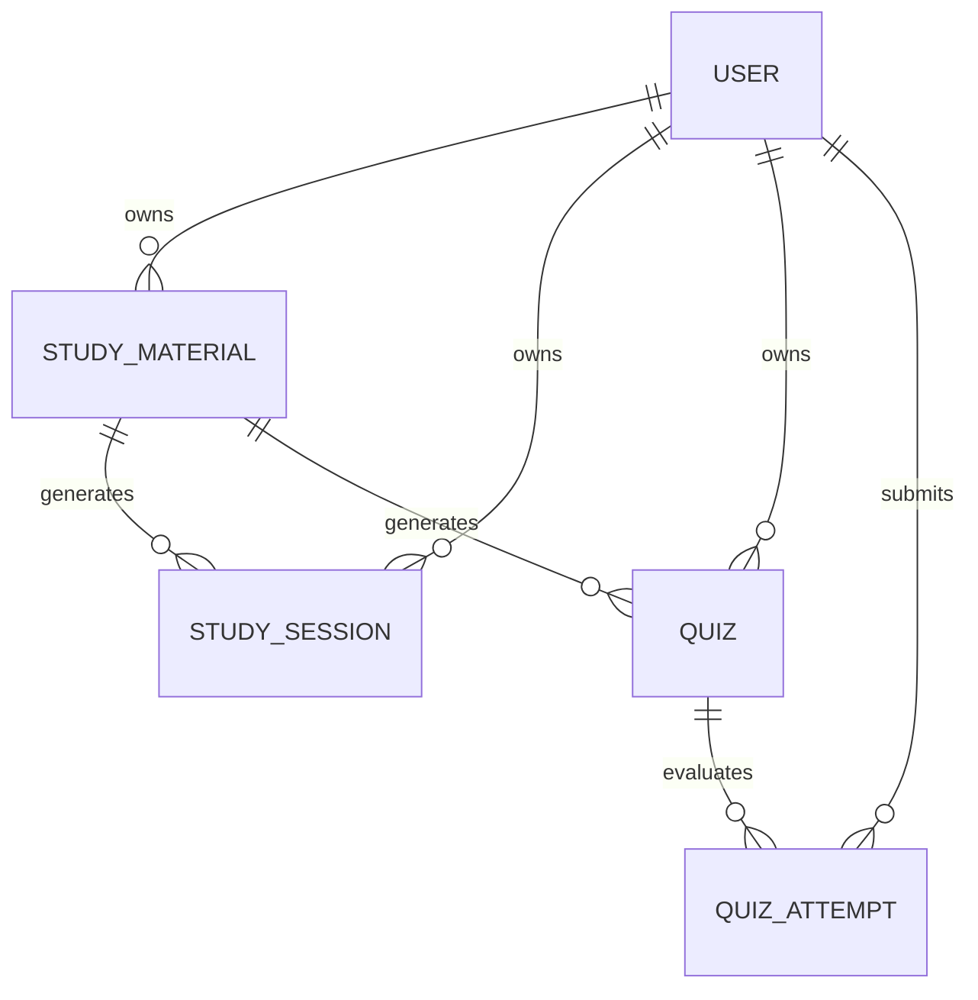

# Preply - Database Architecture & Schema Specification

## 1. Engine & ODM Selection

- **Database Engine**: MongoDB (v6.0+)
- **ODM Layer**: Mongoose (v8.0+)
- **Design Philosophy**: Dynamic document-oriented schemas supporting nested AI-generated content (summaries, concepts, glossaries, exam tips, quiz options, topic accuracy statistics, and weak topic analytics).

---

## 2. Entity Relationship Diagram (ERD)



---

## 3. Schemas & Models (`backend/src/models/`)

### 3.1 `User` Schema (`users` collection)
Stores student accounts, hashed passwords, and study preference settings.

```javascript
{
  name: { type: String, required: true, trim: true, minlength: 2, maxlength: 100 },
  email: { type: String, required: true, unique: true, lowercase: true, trim: true, index: true },
  passwordHash: { type: String, required: true, select: false },
  role: { type: String, enum: ['student', 'admin'], default: 'student' },
  preferences: {
    targetExamDate: { type: Date, default: null },
    studyPace: { type: String, enum: ['slow', 'balanced', 'intensive'], default: 'balanced' },
    preferredDifficulty: { type: String, enum: ['easy', 'medium', 'hard'], default: 'medium' },
    emailNotifications: { type: Boolean, default: true }
  },
  createdAt: Date,
  updatedAt: Date
}
```
- **Security Rule**: `passwordHash` has `select: false` so hashed passwords are never returned in query results unless explicitly requested.

---

### 3.2 `StudyMaterial` Schema (`studymaterials` collection)
Stores PDF metadata, storage reference, processing status, and raw extracted text.

```javascript
{
  userId: { type: Schema.Types.ObjectId, ref: 'User', required: true, index: true },
  title: { type: String, required: true, trim: true, maxlength: 200 },
  originalFileName: { type: String, required: true, trim: true, maxlength: 255 },
  fileType: { type: String, enum: ['pdf', 'docx', 'pptx', 'txt'], default: 'pdf' },
  fileSize: { type: Number, required: true, max: 52428800 },
  storageRef: { type: String, required: true },
  processingStatus: { type: String, enum: ['pending', 'processing', 'completed', 'failed'], default: 'pending', index: true },
  extractedText: { type: String, required: true, minlength: 10 },
  subject: { type: String, default: 'General', trim: true },
  metadata: {
    pageCount: { type: Number, default: 0 },
    wordCount: { type: Number, default: 0 },
    characterCount: { type: Number, default: 0 },
    mimeType: { type: String, default: 'application/pdf' },
    checksum: { type: String, default: '' }
  },
  createdAt: Date,
  updatedAt: Date
}
```
- **Indexes**: Compound index `{ userId: 1, createdAt: -1 }`.

---

### 3.3 `StudySession` Schema (`studysessions` collection)
Stores AI-synthesized structured study guides (summaries, prioritized key topics, glossaries, exam tips).

```javascript
{
  userId: { type: Schema.Types.ObjectId, ref: 'User', required: true, index: true },
  materialId: { type: Schema.Types.ObjectId, ref: 'StudyMaterial', required: true, index: true },
  title: { type: String, required: true, trim: true, maxlength: 200 },
  summary: { type: String, required: true, minlength: 20 },
  keyTopics: [{
    topic: { type: String, required: true },
    description: { type: String, required: true },
    importance: { type: String, enum: ['High', 'Medium', 'Low'], default: 'Medium' }
  }],
  importantConcepts: [{
    concept: { type: String, required: true },
    explanation: { type: String, required: true },
    examples: [{ type: String }]
  }],
  definitions: [{
    term: { type: String, required: true },
    definition: { type: String, required: true }
  }],
  examTips: [{ type: String }],
  recommendedRevisionAreas: [{ type: String }],
  generatedAt: { type: Date, default: Date.now },
  createdAt: Date,
  updatedAt: Date
}
```
- **Indexes**: Compound index `{ userId: 1, materialId: 1 }`.

---

### 3.4 `Quiz` Schema (`quizzes` collection)
Stores generated practice exam questions, options, correct option indices, explanations, and topic tags.

```javascript
{
  userId: { type: Schema.Types.ObjectId, ref: 'User', required: true, index: true },
  materialId: { type: Schema.Types.ObjectId, ref: 'StudyMaterial', required: true, index: true },
  studySessionId: { type: Schema.Types.ObjectId, ref: 'StudySession', required: true, index: true },
  title: { type: String, required: true, trim: true, maxlength: 200 },
  questions: [{
    questionId: { type: String, required: true },
    text: { type: String, required: true },
    options: [{ type: String, required: true }],
    correctOptionIndex: { type: Number, required: true, min: 0 },
    explanation: { type: String, required: true },
    topicTag: { type: String, required: true, index: true },
    difficulty: { type: String, enum: ['Easy', 'Medium', 'Hard'], default: 'Medium' }
  }],
  difficulty: { type: String, enum: ['easy', 'medium', 'hard', 'adaptive'], default: 'medium' },
  generationMetadata: {
    modelName: { type: String, default: 'gemini-2.0-flash' },
    promptTokens: { type: Number, default: 0 },
    completionTokens: { type: Number, default: 0 },
    temperature: { type: Number, default: 0.2 }
  },
  createdAt: Date,
  updatedAt: Date
}
```
- **Virtuals**: `totalQuestions` calculated dynamically from `questions.length`.

---

### 3.5 `QuizAttempt` Schema (`quizattempts` collection)
Stores student quiz attempts, calculated overall score, percentage, topic-by-topic accuracy percentages, and weak topic tags (<70% accuracy).

```javascript
{
  userId: { type: Schema.Types.ObjectId, ref: 'User', required: true, index: true },
  quizId: { type: Schema.Types.ObjectId, ref: 'Quiz', required: true, index: true },
  materialId: { type: Schema.Types.ObjectId, ref: 'StudyMaterial', required: true, index: true },
  answers: [{
    questionId: { type: String, required: true },
    selectedOptionIndex: { type: Number, required: true },
    isCorrect: { type: Boolean, required: true },
    timeSpentSeconds: { type: Number, default: 0 }
  }],
  score: { type: Number, required: true, min: 0 },
  percentage: { type: Number, required: true, min: 0, max: 100 },
  topicWisePerformance: [{
    topicTag: { type: String, required: true },
    totalQuestions: { type: Number, required: true },
    correctAnswers: { type: Number, required: true },
    accuracyPercentage: { type: Number, required: true, min: 0, max: 100 }
  }],
  weakTopics: [{ type: String }],
  completedAt: { type: Date, default: Date.now },
  createdAt: Date,
  updatedAt: Date
}
```
- **Indexes**: Compound index `{ userId: 1, quizId: 1, completedAt: -1 }`.

---

## 4. Connection Lifecycle Diagnostics (`backend/src/config/db.js`)

Continuous database monitoring is provided by `getDatabaseHealth()`:

```json
{
  "status": "connected",
  "connected": true,
  "host": "localhost",
  "port": 27017,
  "name": "preply"
}
```
